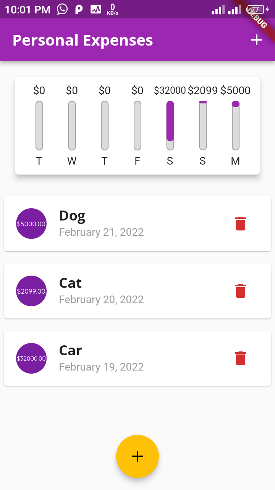

# Personal Expenses

A Flutter application for tracking personal expenses with a beautiful and intuitive user interface. The app helps users manage their daily transactions and visualize weekly spending patterns.

## Features

- **Transaction Management**
  - Add new transactions with title, amount, and date
  - Delete existing transactions
  - View transaction history with detailed information

- **Weekly Spending Chart**
  - Visual representation of daily expenses for the past week
  - Dynamic chart bars showing spending proportions
  - Total spending calculation and percentage visualization

- **Responsive Design**
  - Adaptive UI for different screen sizes
  - Platform-specific styling (iOS/Android)
  - Portrait and landscape mode support

- **User-Friendly Interface**
  - Custom theme with Purple and Amber color scheme
  - Beautiful typography using OpenSans and Quicksand fonts
  - Intuitive transaction input with date picker

## Screenshots




## Getting Started

### Prerequisites

- Flutter SDK
- Android Studio / VS Code
- iOS Simulator (for iOS development)
- Android Emulator (for Android development)

### Installation

1. Clone the repository
```bash
git clone https://github.com/yourusername/personal_expenses.git
```

2. Navigate to the project directory
```bash
cd personal_expenses
```

3. Install dependencies
```bash
flutter pub get
```

4. Run the app
```bash
flutter run
```

## Project Structure

```
lib/
├── models/
│   ├── transaction.dart    # Transaction data model
│   └── chart.dart          # Chart data model
├── widgets/
│   ├── chart.dart          # Weekly spending chart
│   ├── chart_bar.dart      # Individual chart bar
│   ├── new_transaction.dart # New transaction form
│   └── transaction.dart    # Transaction list and items
├── strings.dart            # App strings
└── main.dart              # App entry point and theme
```

## Dependencies

- `intl`: For date formatting and localization
- `flutter/cupertino`: For iOS-style widgets
- `flutter/material`: For Material Design widgets

## Contributing

Contributions are welcome! Please feel free to submit a Pull Request.

## License

This project is licensed under the MIT License - see the [LICENSE](LICENSE) file for details.